# Clawdboard

Painel de uso do Claude para um celular Android parado na mesa. É a versão para celular do
[claude-usage-stick](https://github.com/oauramos/claude-usage-stick), que roda em placas ESP32.

Deixe um celular Android velho na mesa e ele vira um painel sempre ligado: quanto da sessão de 5 horas e da semana você
já usou, quanto falta para liberar, se algum modelo está com problema no status.claude.com e as últimas notícias da Anthropic.
Os modelos aparecem como Clawds em pixel art que piscam, dormem quando a sessão está zerada, suam perto do limite e estouram em 100%.

Projeto pessoal de fã, sem vínculo com a Anthropic. Clawd é o mascote do Claude Code.

**Baixar:** o APK de cada versão fica na aba [Releases](../../releases).

<p align="center">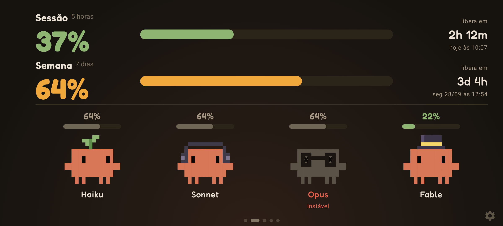</p>

## Prints

| | |
|---|---|
| 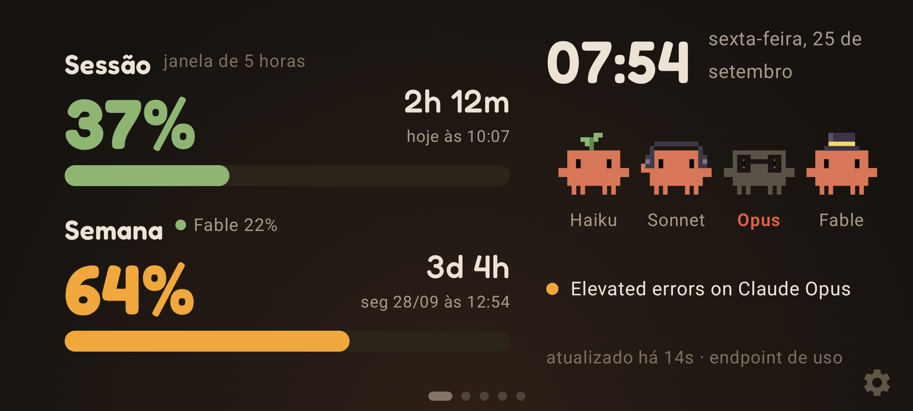 | 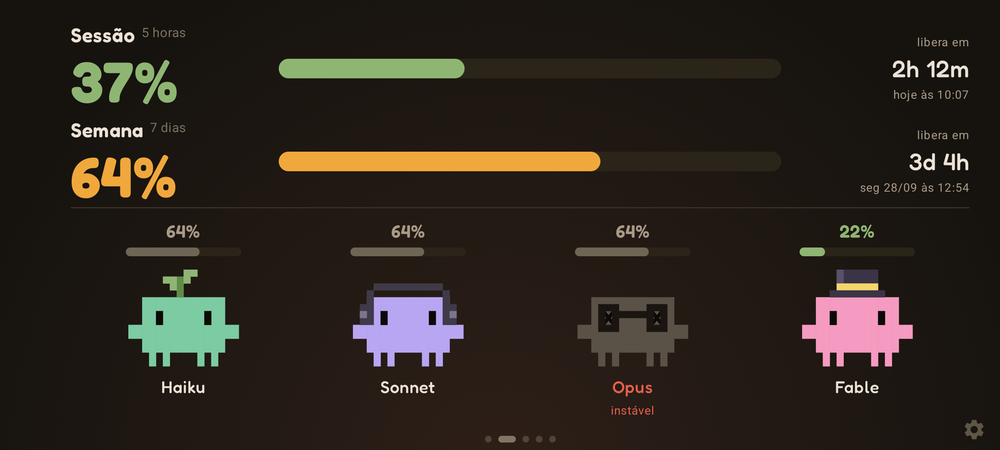 |
| Painel com zoom de acessibilidade em 150% | Uma cor por modelo |
| 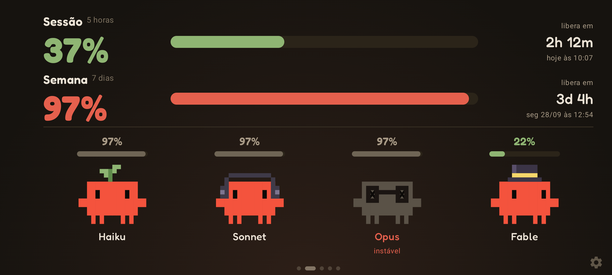 | 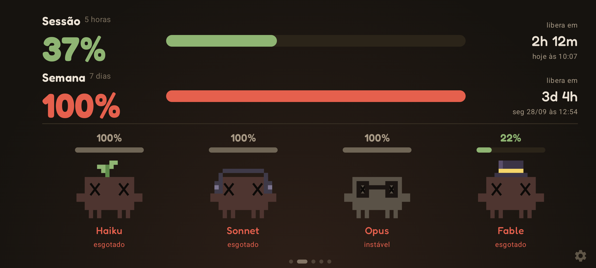 |
| A 97% da semana eles ficam vermelhos e tremem | Em 100% estouram e ficam chamuscados |
| 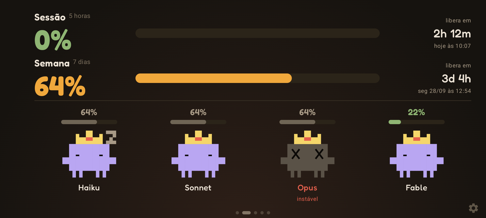 | 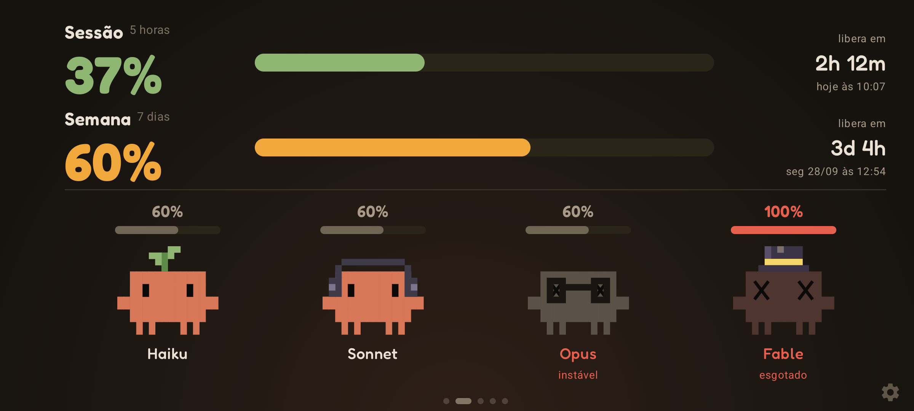 |
| Sessão zerada: dormindo (skin Coroas, cor lavanda) | Limite próprio do Fable em 100%: só ele esgota |
| 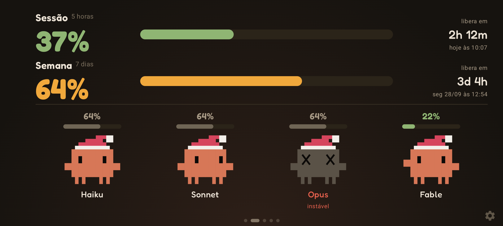 | 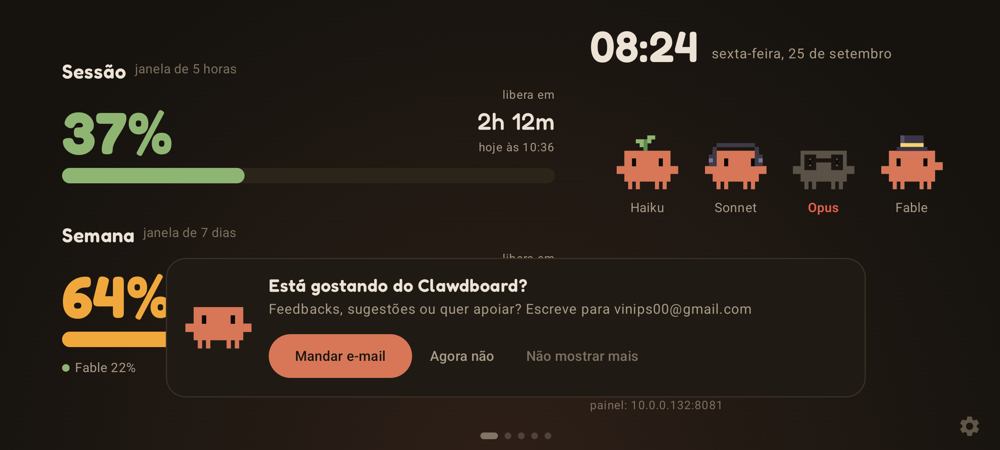 |
| Skin de Natal | Cartão de feedback, de tempos em tempos |

| | | |
|---|---|---|
| 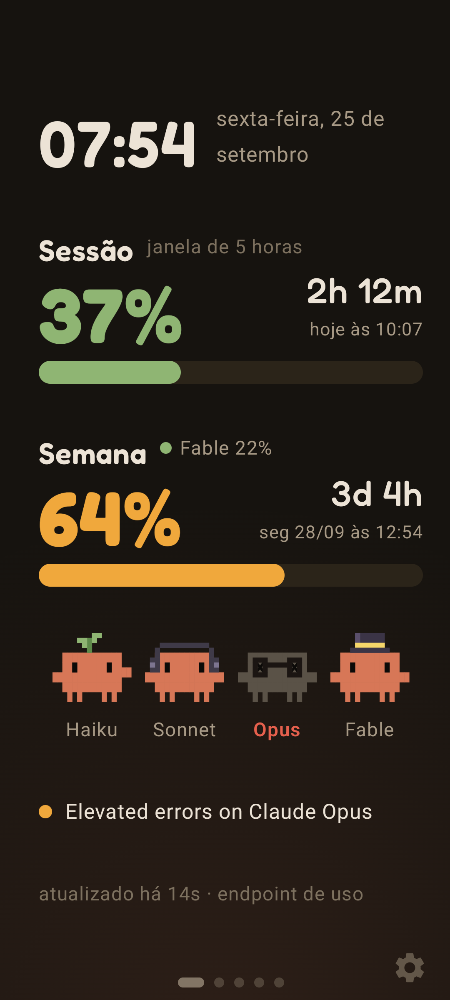 | 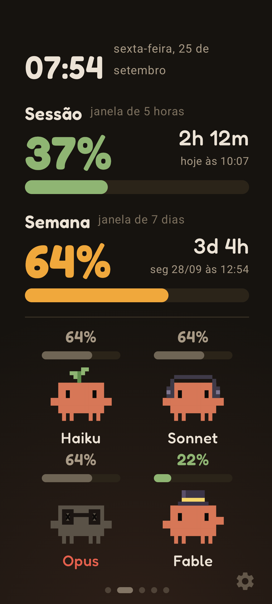 | 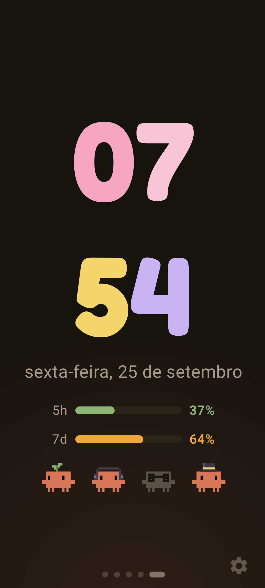 |
| Painel em retrato | Mascotes em retrato | Relógio de mesa |

Painel web, aberto no navegador do PC pela rede local:

<p align="center">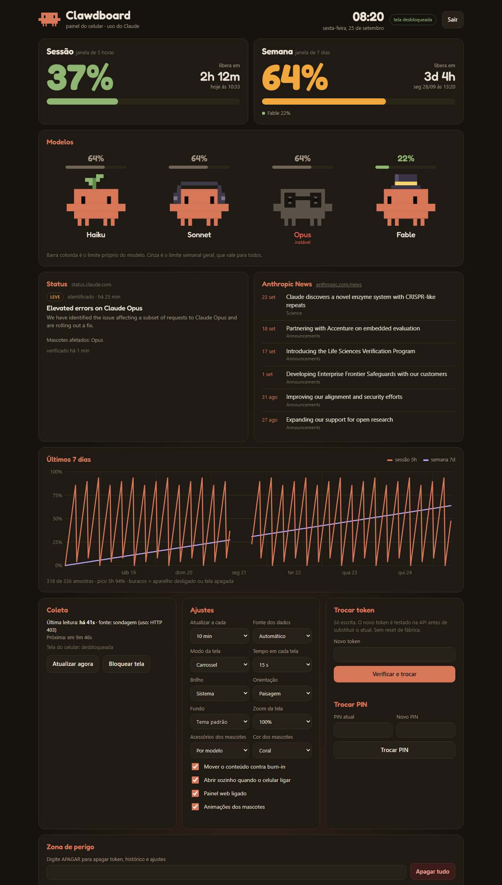</p>

## O que faz

| Recurso | Como funciona aqui |
|---|---|
| Barras de uso ao vivo | Janelas de 5 horas e 7 dias, atualizadas a cada 30 s, 1, 2, 5 ou 10 min. Na sondagem cada consulta é uma mensagem mínima ao Haiku (~11 tokens); 10 min dá 144 por dia |
| Contagem até o reset | Tempo restante e horário local em que cada janela libera |
| Mascotes dos modelos | Haiku, Sonnet, Opus e Fable como Clawds animados. Incidente aberto no status.claude.com que cita o modelo deixa o mascote cinza com olhos em X |
| Token com PIN | AES-256-GCM com chave derivada do PIN (PBKDF2, 150 mil iterações), embrulhado por uma chave do Android Keystore. O PIN nunca é salvo. 10 PINs errados seguidos apagam tudo |
| Painel web | `http://IP-DO-CELULAR:8080` na rede local. Login com o PIN. Entrar no painel também desbloqueia a tela. Mesmo visual do app (fonte Fredoka), mascotes animados com a barra de cada modelo e os mesmos humores, status com a última atualização de cada incidente e as notícias da Anthropic |
| Modos de tela | Estático, mascotes, carrossel ou relógio de mesa: dashboard, mascotes grandes, gráfico de 7 dias, notícias da Anthropic e relógio |
| Histórico de 7 dias | Uma amostra a cada 30 min, no armazenamento interno. Tempo com o app fechado vira buraco no gráfico |
| Troca de token | Só escrita, testada ao vivo na API antes de salvar, sem reset |

Telas: dashboard, **mascotes** (sessão e semana em cima, os quatro Clawds grandes no rodapé com a barra de uso de cada modelo),
gráfico de 7 dias, notícias e relógio. Todas têm layout próprio em paisagem e em retrato; no retrato o relógio empilha horas e minutos.

Barra de cada modelo: quando a API informa um limite próprio do modelo (limite semanal por modelo, hoje só o Fable no plano Team),
a barra é colorida. Os outros modelos consomem do limite semanal geral, então mostram esse valor em cinza.

Skins dos mascotes: "Por modelo" (padrão) põe cartola no Fable, o mais caro, óculos no Opus, fone no Sonnet e um broto no Haiku.
Também há "Clássico" (sem acessório), "Coroas" e "Natal", e cinco cores: coral, arco-íris (uma por modelo), lavanda, menta e chiclete.
O painel web desenha a mesma skin, a partir da definição que o app manda em `state.look`.

Animações: além de piscar, eles olham para os lados, mexem as patas, acenam e agacham de vez em quando.
Com a sessão de 5 horas zerada eles dormem (olho fechado e um Z). A partir de 85% suam e ficam agitados; a partir de 90%
vão ficando vermelhos e pulsam, e de 95% em diante tremem. Em 100% estouram e ficam chamuscados, com olhos em X e fumaça, marcados "esgotado".
Sessão ou semana geral em 100% esgota os quatro; o limite próprio do Fable em 100% esgota só ele. Dá para desligar as animações nos ajustes.

Em cima de cada mascote grande vai só o percentual: barra colorida é limite próprio do modelo, barra cinza é o limite geral.

Zoom de acessibilidade: 90, 100, 115, 130 ou 150% nas telas e nos ajustes. Bloqueio e PIN ficam no tamanho do sistema.
Quando o lado menor da tela fica abaixo de 380dp (zoom alto ou celular pequeno), as telas entram em modo compacto e escondem
linhas secundárias ("libera em", endereço do painel, "instável"); o limite do Fable sobe para o lugar do subtítulo da semana.

Fundo: "Tom do stick" usa a paleta do site do claude-usage-stick (#16130f com brilho coral no rodapé). "Preto AMOLED" economiza mais tela.

Feedback: depois de 3 dias de uso aparece um cartão perguntando se a pessoa está gostando, com botão que abre um e-mail para vinips00@gmail.com. Some sozinho em 30 s, volta a cada 10 dias e tem "Não mostrar mais". Depois de mandar e-mail, só volta em 60 dias. O mesmo contato fica nos créditos dos ajustes e no rodapé do painel web.

Extras para celular: brilho fixo, orientação travada, deslocamento de alguns pixels por minuto
contra marcas na tela AMOLED, abertura automática no boot e exibição por cima da tela de bloqueio.

## De onde vêm os dados

- **Endpoint de uso** `GET https://api.anthropic.com/api/oauth/usage`. Devolve JSON com percentual de 0 a 100. Não gasta requisição, mas não é documentado e pode mudar.
- **Sondagem** `POST https://api.anthropic.com/v1/messages` com Haiku e `max_tokens: 1`. Lê os headers `anthropic-ratelimit-unified-5h-*` e `-7d-*`. É o que o stick faz. Gasta uma requisição mínima por consulta.
- **Automático** tenta o endpoint de uso e cai para a sondagem se o token não tiver permissão ou for limitado.
  Com o token do `claude setup-token` o endpoint responde 403 (falta o escopo `user:profile`), então na prática o app usa a sondagem.
  O rodapé mostra o motivo, por exemplo `sondagem (uso: HTTP 403)`. O limite por modelo que veio do endpoint fica valendo
  por até 3 horas depois da queda. Se a sondagem trouxer headers `anthropic-ratelimit-unified-7d_<modelo>-*`, eles também viram limite próprio.
  Os headers de limite da sondagem vão para o logcat (tag `Clawdboard`) quando mudam, para diagnóstico: `adb logcat -s Clawdboard`.
- Status: `https://status.claude.com/api/v2/incidents/unresolved.json`
- Notícias: feed RSS público `Olshansk/rss-feeds`.

## Primeira configuração

1. No PC, rode `claude setup-token` e copie o token `sk-ant-oat...`. Ele vale um ano.
2. Abra no navegador do PC o endereço que aparece na tela do celular, algo como `http://192.168.0.15:8080`. Cada celular recebe o próprio IP do roteador, e a porta é a primeira livre entre 8080 e 8089. O PC e o celular precisam estar no mesmo Wi-Fi.
3. Crie um PIN de 4 a 8 dígitos e cole o token. O app testa o token na API antes de salvar.

Também dá para configurar direto no celular, pelo link "Prefiro configurar aqui no celular".

Se o roteador reiniciar, o celular pode ganhar outro IP; a tela e o rodapé do painel sempre mostram o endereço atual. Para ele não mudar, reserve um IP fixo para o celular nas configurações de DHCP do roteador.

## Uso no celular

- Arraste para a esquerda para ir à próxima tela e para a direita para voltar. Fora do carrossel, ela volta sozinha para a inicial depois de 30 s.
- A engrenagem no canto inferior direito abre os ajustes depois de pedir o PIN.
- Depois de reiniciar o celular ou o app, a tela pede o PIN de novo. Dá para destravar pelo painel no PC.

## Compartilhar com amigos

O APK de cada versão fica na aba [Releases](../../releases); compilando localmente, ele sai em `dist\`. Quem for instalar precisa:

1. Permitir "instalar apps desconhecidos" para o app usado para abrir o arquivo (Arquivos, Drive, WhatsApp).
2. Gerar o próprio token com `claude setup-token` no PC dele. Cada pessoa usa o próprio token.
3. Abrir o endereço que aparece na tela do celular para configurar pelo navegador do PC.

Abrir sozinho no boot depende de uma permissão que só o ADB concede. Sem ela, o app funciona normal, só não abre sozinho depois de reiniciar:

```powershell
adb shell appops set dev.clawdboard SYSTEM_ALERT_WINDOW allow
```

Atualizar por cima com um APK novo mantém token, PIN, ajustes e histórico, desde que seja assinado pela mesma chave de debug desta máquina.
Depois da atualização o app pede o PIN uma vez.

## Compilar e instalar

Tudo que o build baixa fica em `D:\Android\gradle-home`. O SDK e o JDK usados são os que o Visual Studio já instalou.

```powershell
.\scripts\compilar.ps1
.\scripts\instalar.ps1 -Ip 192.168.0.15   # IP do celular com ADB via Wi-Fi; sem -Ip usa o celular de teste
```

`assembleDebug` gera a prévia `dev.clawdboard.preview`, que instala ao lado do app real sem tocar no token dele.

Ferramentas de diagnóstico via ADB:

```powershell
adb shell am start -n dev.clawdboard.preview/dev.clawdboard.MainActivity --ez demo true --es mode MASCOTS --es orient PORTRAIT
# demo: dados de exemplo, só age quando não há token; mode, orient e backdrop são opcionais
# também: --ei zoom 150, --es skin XMAS, --es tint RAINBOW, --ei p5 0 (sessão zerada, dormem), --ei p7 97 (vermelhos), --ei pf 100 (só o Fable esgota), --ez nudge true (mostra o cartão de feedback)
adb shell am start -n dev.clawdboard/.MainActivity --ez selftest true  # testa o cofre no aparelho
adb logcat -s ClawdSelfTest
```

## Estrutura

- `core/` rede, cofre, histórico, ajustes e o servidor do painel
- `ui/` telas em Jetpack Compose e o Clawd em pixel art
- `assets/panel.html` painel web, sem dependências externas

Criado por Vinícius Pires da Silva.

A fonte Fredoka é distribuída sob a SIL Open Font License; o texto da licença vai dentro do APK em `assets/licenses/`.
Projeto pessoal de fã, sem vínculo com a Anthropic.
