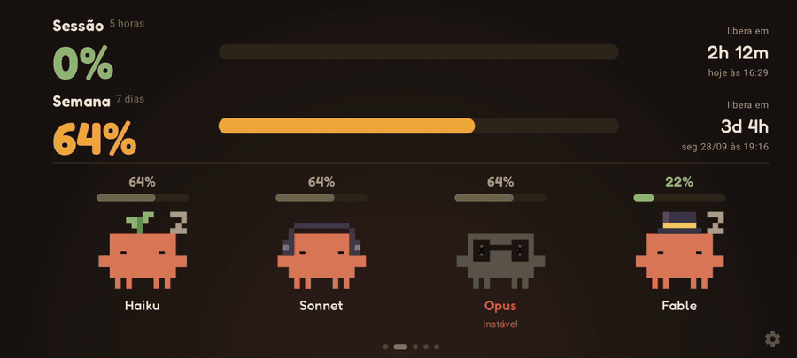
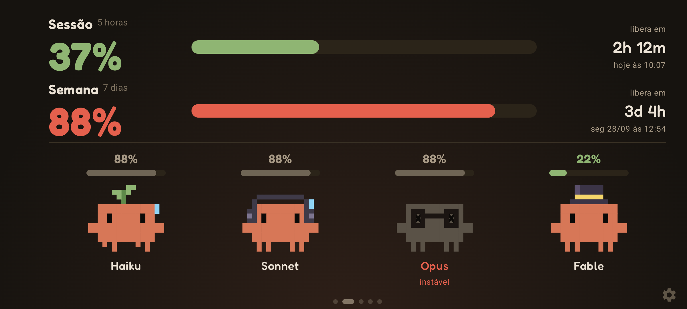
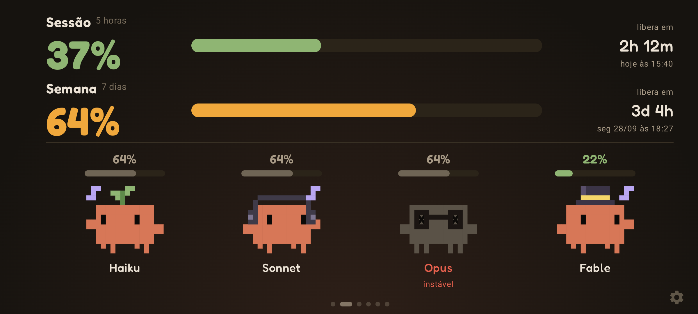
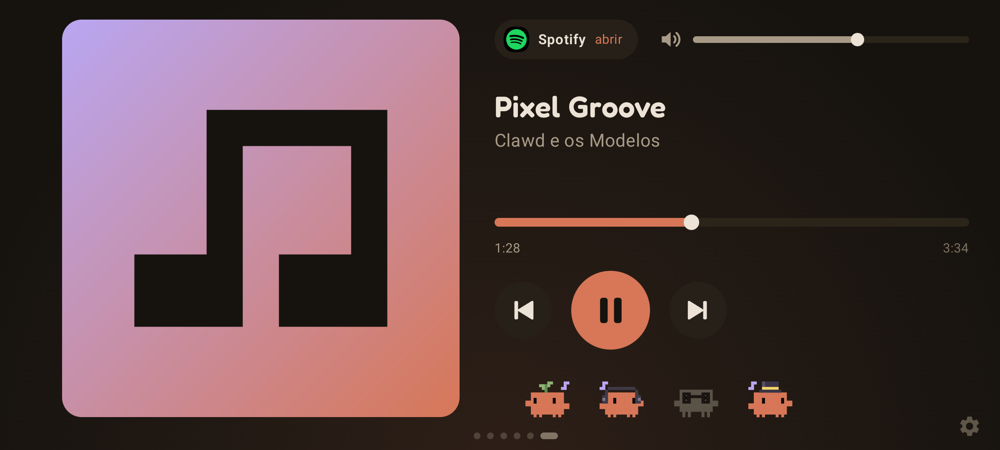
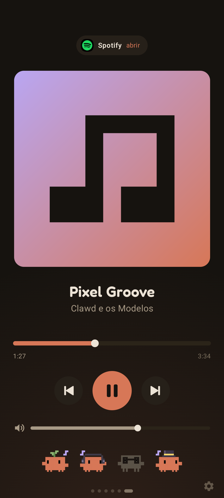
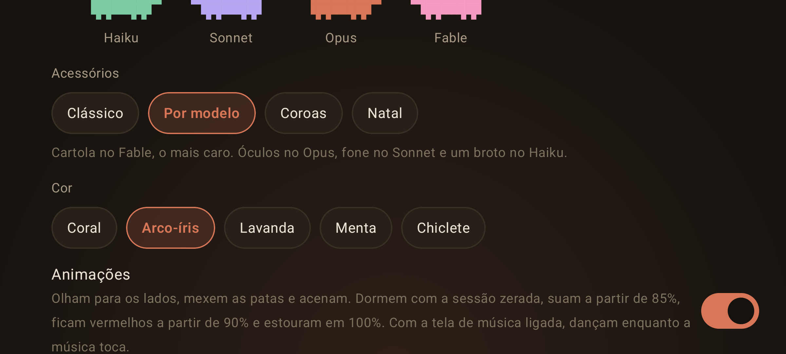
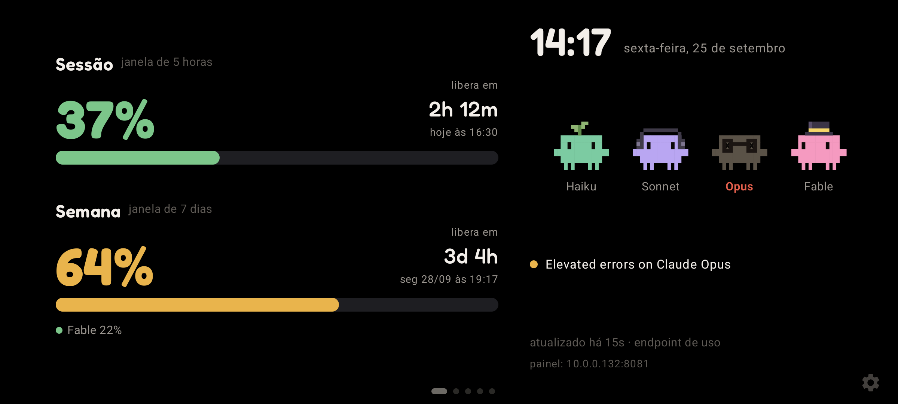

# 👾 Clawdboard

**Turn an old Android phone into a Claude Code usage monitor.**

<p align="center">
  
</p>

<p align="center">
  <a href="../../releases/latest"></a>
  
  
  <a href="../../stargazers"></a>
</p>

<p align="center"><b><a href="../../releases/latest">Download the latest APK</a></b> · <a href="../../releases">All releases</a></p>

## What is Clawdboard?

Clawdboard is an always-on desk display for your Claude plan. It shows how much of the 5-hour session and of the week
you have used, when each one resets and whether any model has an open incident. The models appear as pixel-art Clawds
that sleep, sweat, burst at 100% and dance when music plays.

## Why I built this

I wanted my Claude usage visible on the desk at a glance, without opening a terminal or a browser tab in the middle of work.
Instead of buying hardware for it, I reused an old Android phone: it already has a screen, Wi-Fi and a charger.

## Features

- 📊 **Usage at a glance**: 5-hour session and 7-day week, with a countdown and the local time each one resets
- 👾 **Animated Clawds**: Haiku, Sonnet, Opus and Fable blink, sleep when the session is empty, sweat from 85%, turn red from 90% and burst at 100%
- 🎵 **Music mode**: whatever plays on the phone (Spotify, YouTube Music or any player), with cover, controls and volume, while the Clawds dance on every screen
- 📈 **7-day history**: one sample every 30 minutes
- 🖥️ **Web dashboard**: the same view in your PC browser, on the local network, with PIN login
- 🚦 **Status and news**: open incidents from status.claude.com and the latest Anthropic news
- 🌙 **AMOLED black**: plus a few pixels of shift per minute against burn-in
- 📱 **Portrait and landscape**: a layout for each, and accessibility zoom from 90% to 150%
- 🔐 **Encrypted token**: AES-256-GCM with a key derived from your PIN, wrapped by the Android Keystore

## See it in action

The app's interface is in Brazilian Portuguese.

### Main screens

| | | |
|---|---|---|
|  |  |  |
| Dashboard | Mascots, with each model's bar | Desk clock |

### Clawd reactions

| | | |
|---|---|---|
|  |  |  |
| Empty session: asleep | 88%: sweating | 97%: red and shaking |
|  |  |  |
| 100%: burst | Fable's own limit at 100%: only Fable bursts | Music playing: dancing |

### Music mode

| | |
|---|---|
|  |  |
| Cover, track, controls and volume | Portrait |

### Skins and settings

| | | |
|---|---|---|
|  |  |  |
| One color per model | Christmas skin | Settings, at 150% zoom |

### Web dashboard and AMOLED

| | |
|---|---|
|  |  |
| Web dashboard in the PC browser | AMOLED black |

## Got an old Android phone?

Got an old Android phone sitting in a drawer? Turn it into a dedicated Claude Code dashboard. Anything running Android 8.0
or newer works. Plug it in, lean it against the monitor and it stays on: fixed brightness, locked orientation, pixel shift
against AMOLED burn-in, opens by itself when the phone boots and shows over the lock screen.

## Quick Start

1. Download the APK from [Releases](../../releases/latest) and install it (allow "install unknown apps" for the app that opens the file).
2. On your PC, run `claude setup-token` and copy the `sk-ant-oat...` token. Read the heads-up below first.
3. Open the address shown on the phone in your PC browser, create a PIN and paste the token.
4. Leave the phone on your desk.

> **Heads-up:** Anthropic's current terms say that subscription OAuth tokens are meant for Claude Code and Anthropic's own
> apps ([Legal and compliance](https://code.claude.com/docs/en/legal-and-compliance)). Clawdboard uses the token you generate
> to send a 1-token request to Haiku and read your limit headers. Read the policy and decide for yourself. A mode that reads
> usage from Claude Code's status line and keeps no token on the phone is on the [roadmap](#roadmap).

## How it works

```
 claude setup-token  (on your PC, once)
          │  token typed once, encrypted with your PIN
          ▼
 ┌──────────────────┐
 │  Android phone   │ ──► api.anthropic.com    1-token Haiku request → 5h and 7d limit headers
 │   Clawdboard     │ ──► status.claude.com    open incidents
 │                  │ ──► public RSS feed      Anthropic news
 └──────────────────┘
          │
          ├──► 👾 Clawds on the phone screen
          └──► web dashboard on your local network (http://PHONE-IP:8080)

 Music mode reads and controls the phone's own media session. No account involved.
```

## Security

- The token is encrypted with AES-256-GCM using a key derived from your PIN (PBKDF2, 150,000 iterations) and wrapped by an Android Keystore key, which blocks brute force off the device. The PIN is never stored.
- 10 wrong PINs in a row wipe the token, the history and the settings.
- The token is write-only: it is never shown again. A new token is tested against the API before it replaces the old one.
- The web dashboard only runs on the local network, asks for the same PIN and only answers when the Host is an IP address, `localhost` or a `.local` name, which blocks DNS rebinding. Logging in on the dashboard also unlocks the phone screen.
- Music mode needs notification access because Android only shows the active player to apps with that access. Clawdboard uses it to see and control the player; it does not read your notifications.

## Configuration

**First setup.** The phone shows its address, something like `http://192.168.0.15:8080`. The port is the first free one between
8080 and 8089, and the PC and the phone must be on the same Wi-Fi. You can also set everything up on the phone itself through
"Prefiro configurar aqui no celular". If the router restarts the phone may get a new IP; the screen and the dashboard footer
always show the current one. Reserve a fixed IP for the phone in the router's DHCP settings to avoid that.

**On the phone.** Swipe left for the next screen and right to go back. Outside the carousel, it returns to the home screen after
30 seconds. The gear in the bottom right corner opens the settings after asking for the PIN. After a reboot or an app restart
the screen asks for the PIN again, and you can unlock it from the web dashboard.

**Refresh.** Every 30 seconds, 1, 2, 5 or 10 minutes. Each probe is a minimal Haiku request (about 11 tokens); 10 minutes means 144 a day.

**Screens and modes.** Dashboard, mascots (session and week on top, the four Clawds below with each model's bar), 7-day chart,
news, desk clock and music (when enabled). Screen modes: static, mascots, carousel or clock. In the carousel the music screen only
shows up while something is playing.

**Per-model bar.** When the API reports a model's own limit (a weekly per-model limit, today only Fable on the Team plan), the bar
is colored. The other models draw from the general weekly limit, so they show that value in gray.

**Skins.** "Por modelo" (the default) puts a top hat on Fable, the most expensive one, glasses on Opus, headphones on Sonnet and
a sprout on Haiku. There are also "Clássico" (no accessory), "Coroas" and "Natal", and five colors: coral, rainbow (one per model),
lavender, mint and bubblegum. The web dashboard draws the same skin from the definition the app sends in `state.look`.

**Animations.** Besides blinking, they look around, move their legs, wave and crouch. With the 5-hour session at zero they sleep
(eyes closed and a Z). From 85% they sweat and get restless; from 90% they turn red and throb, and from 95% they shake. At 100% they
burst and stay charred, with X eyes and smoke, marked "esgotado". Session or general week at 100% bursts all four; Fable's own
limit at 100% bursts only Fable. An open incident on status.claude.com that names a model turns its Clawd gray with X eyes.
Animations can be turned off in the settings.

**Music.** Settings → Música → "Tela de música", then "Liberar acesso" and allow Clawdboard. Clawdboard plays nothing itself: it reads
and controls the player of the app that is playing, through Android's media session. The screen shows the album cover, the track,
the icon of the app (one tap opens its player, to change playlists), the progress bar, the buttons, the app's extra buttons and the
volume: the phone's media volume or, when the app sends the sound to another device, that device's volume. While music plays, every
Clawd dances on every screen, the web dashboard included: sleepy ones wake up, sweaty ones dance sweating and burst ones tap a foot.
On an APK installed through a browser or file manager, Android 13 and later may say it is a "restricted setting". In that case:
Settings → Apps → Clawdboard → ⋮ → Allow restricted settings, and try again.

**Zoom and compact mode.** 90, 100, 115, 130 or 150% on the screens and in the settings; the lock and PIN screens keep the system size.
When the shorter side of the screen drops below 380dp (high zoom or a small phone), the screens switch to a compact layout and hide
secondary lines; Fable's limit moves up to the week's subtitle.

**Background.** "Tema padrão" uses warm dark tones (#16130f with a coral glow at the bottom). "Preto AMOLED" saves more screen.

**Feedback.** After 3 days of use a card asks whether you are enjoying the app, with a button that opens an email to
vinips00@gmail.com. It hides itself after 30 seconds, comes back every 10 days and has "Não mostrar mais". After you send an email
it only returns in 60 days. The same contact is in the settings credits and in the web dashboard footer.

**Open on boot.** It needs a permission only ADB can grant. Without it the app works normally, it just does not open by itself after a reboot:

```powershell
adb shell appops set dev.clawdboard SYSTEM_ALERT_WINDOW allow
```

**Updating.** Installing a new APK over the old one keeps the token, PIN, settings and history, as long as it is signed with the same
key. The app asks for the PIN once after the update.

## Development

Needs JDK 17 and the Android SDK with API 35 (in `ANDROID_HOME` or in `sdk.dir` of `local.properties`):

```powershell
.\gradlew.bat testReleaseUnitTest assembleDebug
adb install -r app\build\outputs\apk\debug\app-debug.apk
```

`assembleDebug` builds the preview `dev.clawdboard.preview`, which installs next to the real app without touching its token and accepts
the sample data below. `assembleRelease` builds the regular app; locally it goes to `dist\`.

On my machine I use the shortcuts in `scripts\`, which point to Gradle in `D:\Android\gradle-home` and to the JDK installed by Visual Studio:

```powershell
.\scripts\compilar.ps1
.\scripts\instalar.ps1 -Ip 192.168.0.15   # phone IP with ADB over Wi-Fi; without -Ip it uses the test phone
```

Diagnostics over ADB:

```powershell
adb shell am start -n dev.clawdboard.preview/dev.clawdboard.MainActivity --ez demo true --es mode MASCOTS --es orient PORTRAIT
# demo: sample data, only works when there is no token; mode, orient and backdrop are optional
# also: --ei zoom 150, --es skin XMAS, --es tint RAINBOW, --ei p5 0 (empty session, asleep), --ei p7 97 (red), --ei pf 100 (only Fable bursts), --ez nudge true (feedback card)
# --ez music true turns on the music screen with a sample track playing (Clawds dancing); --ez playing false leaves it paused
adb shell am start -n dev.clawdboard/.MainActivity --ez selftest true  # tests the vault on the device
adb logcat -s ClawdSelfTest
```

### Where the data comes from

- **Usage endpoint** `GET https://api.anthropic.com/api/oauth/usage`. Returns JSON with percentages from 0 to 100. Costs no request, but it is undocumented and may change.
- **Probe** `POST https://api.anthropic.com/v1/messages` with Haiku and `max_tokens: 1`. Reads the `anthropic-ratelimit-unified-5h-*` and `-7d-*` headers. Costs one minimal request per check.
- **Automatic** tries the usage endpoint and falls back to the probe when the token lacks permission or is rate limited.
  With a `claude setup-token` token the endpoint answers 403 (missing the `user:profile` scope), so in practice the app uses the probe.
  The footer shows the reason, for example `sondagem (uso: HTTP 403)`. A per-model limit that came from the endpoint stays valid for
  up to 3 hours after it fails. If the probe returns `anthropic-ratelimit-unified-7d_<model>-*` headers, they also become a model's own limit.
  The probe's limit headers go to logcat (tag `Clawdboard`) when they change: `adb logcat -s Clawdboard`.
- Status: `https://status.claude.com/api/v2/incidents/unresolved.json`
- News: the public RSS feed `Olshansk/rss-feeds`.

## Architecture

- `core/`: network, vault, history, settings, music (Android media session) and the web dashboard server
- `ui/`: Jetpack Compose screens and the pixel-art Clawd
- `MediaListener.kt`: the notification listener Android requires to see the active player
- `assets/panel.html`: the web dashboard, with no external dependencies

## Roadmap

- **Status line mode:** read the 5-hour and weekly usage from Claude Code's status line on your PC and send it to the phone over the local network, so the phone never holds a token.
- **Android 16:** target API 36.

## Contributing

Issues and pull requests are welcome. For bigger changes, open an issue first so we can talk about it. The code has no comments on
purpose: explanations go in this README. The app's text is in Brazilian Portuguese. Feedback and ideas: vinips00@gmail.com.

## License

There is no open-source license yet, so all rights are reserved. The Fredoka font is distributed under the SIL Open Font License;
its text ships inside the APK in `assets/licenses/`.

## Disclaimer

Clawdboard is a personal fan project, **not affiliated with, endorsed by or sponsored by Anthropic**. Claude and Claude Code are
trademarks of Anthropic, PBC, and Clawd is the Claude Code mascot.

Built with ❤️ by Vinícius Pires da Silva.
